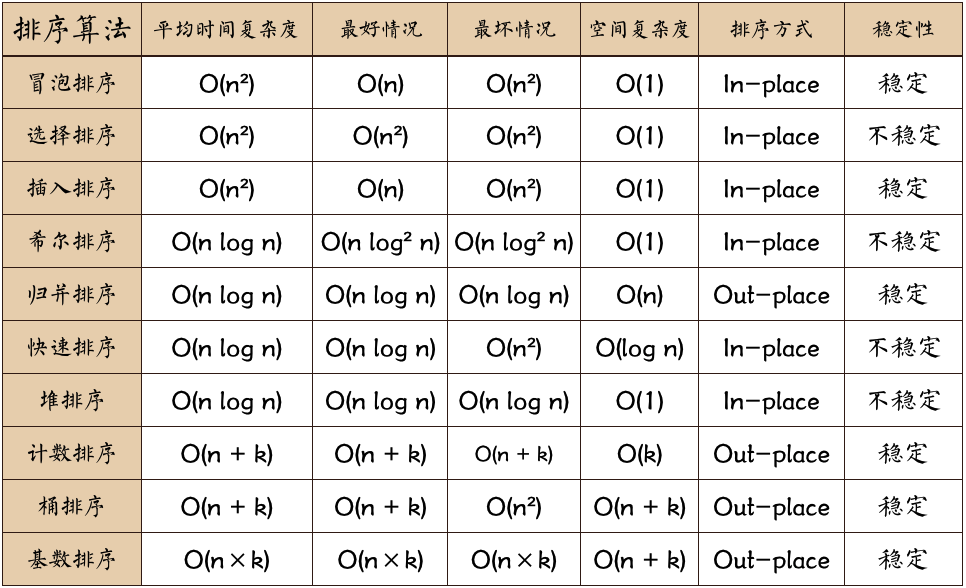
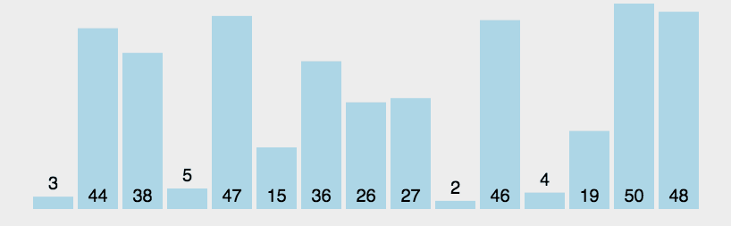
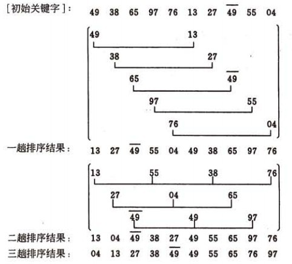

# 排序算法

## 算法对比

**说明**

1. 对于评述算法优劣术语的说明

    稳定：如果 a 原本在 b 前面，而 a=b，排序之后 a 仍然在 b 的前面;

    不稳定：如果 a 原本在 b 的前面，而 a=b，排序之后 a 可能会出现在 b 的后面;

    内排序：所有排序操作都在内存中完成;

    外排序：由于数据太大，因此把数据放在磁盘中，而排序通过磁盘和内存的数据传输才能进行;

    时间复杂度：一个算法执行所消耗的时间;

    空间复杂度：运算完一个程序所需内存的大小;

2. 名词解释

    n：数据规模

    k：“桶”的个数

    In-place：内排序

    Out-place：外排序

## 冒泡排序 Bubble Sort

冒泡排序是一种简单的排序算法。它重复地走访过要排序的数列，一次比较两个元素，如果它们的书序错误就把它们交换过来。重复的走访直到再没有需要交换，也就是说该数列已经排序完成。这个算法的名字又来是因为越小的元素会经由交换慢慢的“浮”到数列的前端。

### 描述和实现

* 基本冒泡算法

    1. 比较相邻的元素。如果第一个比第二个大，就交换它们两个;
    2. 对每一对相邻元素作同样的工作，从开始第一对到结尾的最后一对，这样在最后的元素应该会是最大的数;
    3. 针对所有的元素重复以上的步骤，除了最后一个;
    4. 重复步骤1~3，直到排序完成;

* 算法改进 1

    设置一标志性变量 pos,用于记录每趟排序中最后一次进行交换的位置;

    由于 pos 位置之后的记录均已交换到位,故在进行下一趟排序时只要扫描到pos位置即可，如果有一趟排序中没有产生交换的话，pos 为 0，那么说明此刻数列以及变成了有序数列;

* 算法改进 2

    传统冒泡排序中每一趟排序操作只能找到一个最大值或最小值，我们考虑利用在每趟排序中进行正向和反向两遍冒泡的方法一次，可以得到两个最终值(最大者和最小者),从而使排序趟数几乎减少了一半

实现见代码 [bubble_sort.py](./bubble_sort.py)

### 动图演示

### 复杂度分析

* 最佳情况：T(n)=O(n²) 或 T(n)=O(n)

    当输入的数据已经是正序时是最佳情况。
    
    在第一种算法中，时间复杂度为 `n+(n-1)+(n-2)+……+1=n(n-1)/2`，复杂度为 `O(n²)`;
    
    在第二种算法中有一个标志位，如果有一趟排序中没有产生交换的话，标志位为 0，那么说明此刻数列已经变成了有序的数列，会跳出循环。如果是正序的话，会直接遍历一遍，不产生交换，标志位为 0，直接跳出循环，所以复杂度为 `O(n)`;

* 最差情况：T(n)=O(n²)

    当输入的数列是反序时，两种算法都需要遍历数列并交换，时间复杂度都为 `n(n-1)/2`，即 `O(n²)`;

* 平均情况：T(n)=O(n²)

## 选择排序 Selection Sort

选择排序是一种简单直观的排序算法。它的工作原理：首先在未排序序列中找到最小（大）元素，存放到排序序列的起始位置，然后，再从剩余未排序元素中继续寻找最小（大）元素，然后放到已排序序列的末尾。以此类推，直到所有元素均排序完毕。

无论什么数据进去都是 `O(n²)` 的时间复杂度，所以用到它的时候，数据规模越小越好。

### 描述和实现

n 个记录的直接选择排序可经过 n-1 趟直接选择排序得到有序结果。具体算法描述如下：

1. 初始状态：无序区为 R[1..n]，有序区为空；
2. 第 i 趟排序 (i=1,2,3...n-1) 开始时，当前有序区和无序区分别为 R[1..i-1] 和 R(i..n）。该趟排序从当前无序区中找出最小的记录 R[k]，将它与无序区的第 1 个记录 R 交换，使 R[1..i] 和 R[i+1..n) 分别变为记录个数增加 1 个的新有序区和记录个数减少 1 个的新无序区；
3. n-1 趟结束，数组有序化了。

实现见代码 [selection_sort.py](./selection_sort.py)

### 动图演示

### 复杂度分析

选择排序只有一种情况，`T(n) = O(n²)`。

外层会从头到倒数第二位遍历一遍，内层会遍历一遍无序区，所以时间复杂度为 `(n-1)((n-1)+(n-2)+……+2+1)=n(n-1)/2`，即 `O(n²)`;

## 插入排序 Insertion Sort

插入排序的算法描述是一种简单直观的排序算法。它的工作原理是通过构建有序序列，对于未排序数据，在已排序序列中从后向前扫描，找到相应位置并插入。插入排序在实现上，通常采用in-place排序（即只需用到O(1)的额外空间的排序），因而在从后向前扫描过程中，需要反复把已排序元素逐步向后挪位，为最新元素提供插入空间。

插入排序和打扑克牌时摸牌有点类似，从一堆无序的牌中拿出最上面一张，然后从后往前对比，找到合适的位置插入。

### 描述和实现

一般来说，插入排序都采用 in-place 在数组上实现。具体算法描述如下：

* 基本插入排序

    1. 从第一个元素开始，该元素可以认为已经被排序；
    2. 取出下一个元素，在已经排序的元素序列中从后向前扫描；
    3. 如果该元素（已排序）大于新元素，将该元素移到下一位置；
    4. 重复步骤3，直到找到已排序的元素小于或者等于新元素的位置；
    5. 将新元素插入到该位置后；
    6. 重复步骤2~5。

* 二分法插入排序

    1. 从第一个元素开始，该元素可以认为已经被排序；
    2. 取出下一个元素，将取出的元素与已排序区的中间值比较;
    3. 找出元素所在区间;
    4. 重复以上步骤，直到区间只剩两个数值;
    5. 将取出元素插入到区间中;
    6. 重复步骤2~5。

实现见代码 [insertion_sort.py](./insertion_sort.py)

### 动图演示

### 复杂度分析

* 最佳情况：T(n) = O(n)
    
    当使用第一种算法时，当输入数列是正序时最佳。取出的数直接与有序区的最后一位比较，是大于最后一位的，直接排在后面，所以直接遍历一遍即可，复杂度为 `O(n)`;

    而当使用二分法插入排序时，最佳情况是当插入的位置刚好是二分位置，复杂度为 `O(n)`。

* 最坏情况：T(n) = O(n²)

    当输入数列是反序时最坏。
    
    当使用第一种算法时，取出的数要遍历一遍有序区才能找到位置插入，所以复杂度为 `(n-1)(1+2+3+……+(n-1))=n(n-1)/2`，即 `O(n²)`;

    当使用二分法插入排序时，外循环从 1 开始遍历，内循环用二分法查找插入，所以时间复杂度为 `(n-1)((2log₂1+1)+(2log₂2+1)+……+(2log₂(n)+1))=n²-2n+2(n-1)log₂n(n!)+1`，即 `O(n²)`。

* 平均情况：T(n) = O(n²)

## 希尔排序 Shell Sort

希尔排序是插入排序的一种更高效率的实现。它与插入排序的不同之处在于，它会优先比较距离较远的元素。希尔排序的核心在于间隔序列的设定。既可以提前设定好间隔序列，也可以动态的定义间隔序列。

### 描述和实现

将整个待排序的记录序列分割成为若干子序列分别进行直接插入排序，具体算法描述：

1. 选择一个增量序列t1，t2，…，tk，其中ti>tj，tk=1；
2. 按增量序列个数k，对序列进行k 趟排序；
3. 每趟排序，根据对应的增量ti，将待排序列分割成若干长度为m 的子序列，分别对各子表进行直接插入排序。仅增量因子为1 时，整个序列作为一个表来处理，表长度即为整个序列的长度

实现见代码 [shell_sort.py](./shell_sort.py)

### 图片演示

### 复杂度分析

* 最佳情况：T(n) = O(n log₂n)

* 最坏情况：T(n) = O(n log₂n)

* 平均情况：T(n) = O(nlog₂n)

## 归并排序
### 描述和实现

### 动图演示

### 复杂度分析

## 快速排序

### 描述和实现

### 动图演示

### 复杂度分析

## 堆排序

### 描述和实现

### 动图演示

### 复杂度分析

## 计数排序

### 描述和实现

### 动图演示

### 复杂度分析

## 桶排序

### 描述和实现

### 动图演示

### 复杂度分析

## 基数排序

### 描述和实现   

### 动图演示

### 复杂度分析